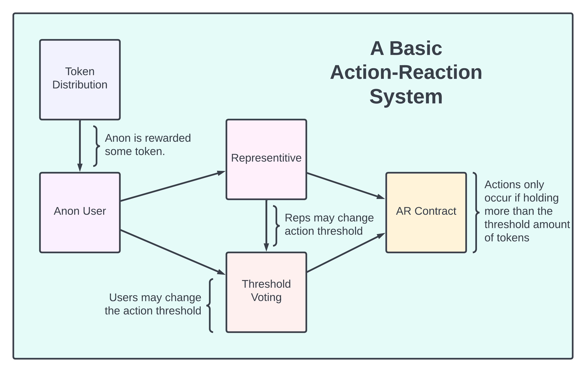

# Action-Reaction

A system of contracts demonstrating a decentralized hot wallet using an action token and vote representation. This is a set of contracts trying to accomplish an action token distribution, action threshold voting, vote representation, and an example contract using a representitive holding action tokens as the signer for a validation function.

## Action Tokens

The distribution contract in this repo is an example of a token distribution. The action-reaction system is designed to handle any fungible token, an already existing token or a token that is minted on-the-fly with smart contracts. The action token is use case specific and can be anything.

### The Token Distribution

In this repo, the action token distribution is handled via a finite supply contract, via a lock and mint combo, incentivising early adoptors with larger rewards of the action token. The reward function decreases logarithmically with each transaction, depleting in 262,143 transactions for a total of 524,268 action tokens. 


The graph above displays the first 1000 transactions for the action token reward function. It starts at 18 million tokens initially then decays to 9 million over the course of 1000 transactions. Below is a table displaying the number of tokens available in millions and the percentage of the total token distributed.

```
Num Tx    Tokens   % Distro
     1        36     0.00 %
    10       179     0.03 %
   100      1338     0.25 %
  1000     10031     1.91 %
 10000     66387    12.66 %
100000    331072    63.14 %
262143    524268   100.00 %
```

This distribution will take a long time to deplete and is an example.

## The Action Threshold

The contracts are designed to determine whether or not a user may perform an action inside a contract based off of the amount of action tokens held in the transaction. The determining factor is the action threshold, a percentage of the total distribution that must be held inside some transaction.

The action threshold and action token information are held in the voting contract, allowing anyone with at least the threshold amount of action token to change the action threshold parameter. As the token becomes more distributed and decentralized, the ability to obtain enough actions tokens to do single party voting will become sufficiently hard or expensive. Many holders of the action token will need to delegate their action tokens to a representitive. The representitive will act as a signer by holding other user's action tokens and issuing iou tokens in their place. This allows the community to collectively combine their powers together through a single signer to change or act in the system.

## Use Cases

As the action token becomes more distributed through the Cardano ecosytem, larger and larger representitives will amass inside the system. The collective mass can be used to determine if an action may or may not occur because they hold enough action tokens from enough users that they dominate the system. In this situation, the representitive acts like a single hot wallet. A decentralized approach to a centralized signing structure.

In the example contract, the validator simply checks for reference or user tokens and the correct signatures. This action token checking algorithm can be used as the replacement tx signer function. It can be a replacement for any master key that is being used inside a contract. The action token distribution can also be modified to allow only a select group of holders to accumulate, a flat rate for equal participation, or use an already existing token. It is supposed to be form fitted for the exact use case, from federated groups to fully decentralized token distributions.



### NFT Creation

An important use case is minting sequential NFTs in a DAO-like setting. In this situation, each member has a singular action token. The action token acts like a n-out-of-m multisig between all DAO members. The DAO has a hot wallet representitive that all the members delegate their action tokens too. The representitive will mint an NFT using a sequential NFT generator, modified for action tokens and vote representation. 

This example will facilitate the act of petitioning a DAO for a true NFT. A group who gets this NFT or uses the NFT may say that the community of the DAO collectively came together to mint this unique NFT. This type of behavior in the Cardano ecosystem is beneficial for smart contract developers. It is very typical to use an NFT to start a contract. If dApps required that the starting token be minted in a decentralized manner then an option would be to use an action-reaction system for that minting.

### Group Voting

An action-reaction system allows a token to be used in combination with known wallets to build a collection of contracts for voting. For example, a simple binary choice can be achieved with one representitive being yes and another being no, or zero and one or true/false, etc. If one representitive obtains enough action tokens then the vote passes else it will continue until the vote ends and the larger holder wins. The winner wins by submitting a transaction that updates the datum into a new state.

### Micro-DAOs

There are many situations in which a micro-DAO, some anon group of token holders, will form and will require some form of voting. The AR system may be applicable in this case. A temporary voting token spawns into existence for some period of time which becomes the action token for an action-reaction system. Then other contracts can be built using the AR system that does whatever the micro-DAO needs. An example is a set of contracts that allows a collection of ada to accrue via an iou exchange. The iou token becomes the action token for a AR system that handles where the ada is staked and how the rewards are paid out.


The flow above describes a possible micro-dao for staking a collection of ADA. The action-reaction system handles the group choice of what pool to stake the ada and how the rewards are paid out to participating wallets. The micro-dao, and thus an action-reaction system, is a natural by-product of group activities that involve some form of iou-style tokens or voting tokens. 